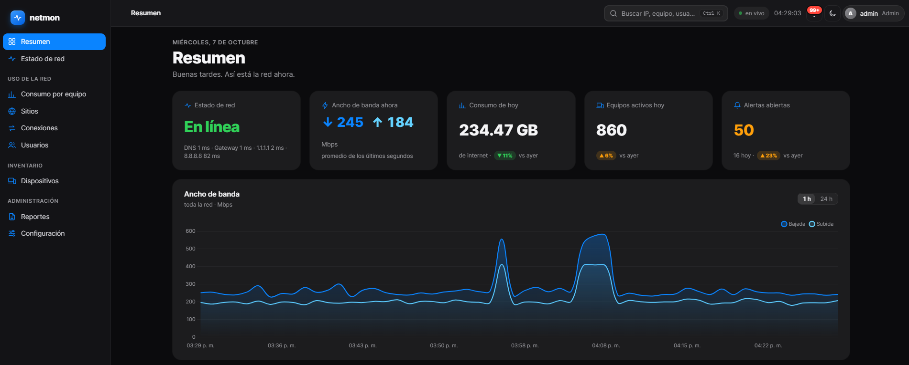

<h1 align="center">Fabrizio Riello</h1>

  Network Analyst · Infrastructure & Security Operations · Buenos Aires, Argentina

---

I run networking, endpoint and security tooling for a ~100-person pharmaceutical company in a GxP-regulated environment, where every change goes through change control and leaves an audit trail. I enjoy designing systems end to end, and I'm building toward **Cloud Security Engineering**.

### Stack

**Networking** — Active Directory · WatchGuard · Aruba / Ruckus · VLANs & port mirroring · VMware ESXi\
**Security** — Wazuh · Suricata · Grafana · Kaspersky Security Center · GPO hardening\
**Automation** — Python (FastAPI, asyncpg) · PostgreSQL · Bash · PowerShell · systemd · Docker

### Featured work

**[Netmon](https://github.com/Sitid/Netmon)** — Passive network monitoring for a ~100-seat Active Directory network. SPAN capture with ntopng/nDPI (L7 classification by TLS SNI and DNS, no payload inspection), real-time NOC-style dashboard, per-user attribution through AD, configurable alerting and weekly PDF/CSV reports. Ships with a Wazuh + Suricata + Grafana SOC stack.\
Python · FastAPI · WebSocket · PostgreSQL · ntopng · systemd

**[brave-hardening-gpo](https://github.com/Sitid/brave-hardening-gpo)** — Hardened browser rollout for a Windows domain: a WiX-built MSI that enforces 13 Brave policies through Group Policy, plus a PowerShell fallback for RMM tools.\
WiX · PowerShell · Group Policy

### Now

- Bachelor's in Information Systems at Universidad del Salvador (USAL)
- Studying for CompTIA Security+, then Microsoft AZ-104
